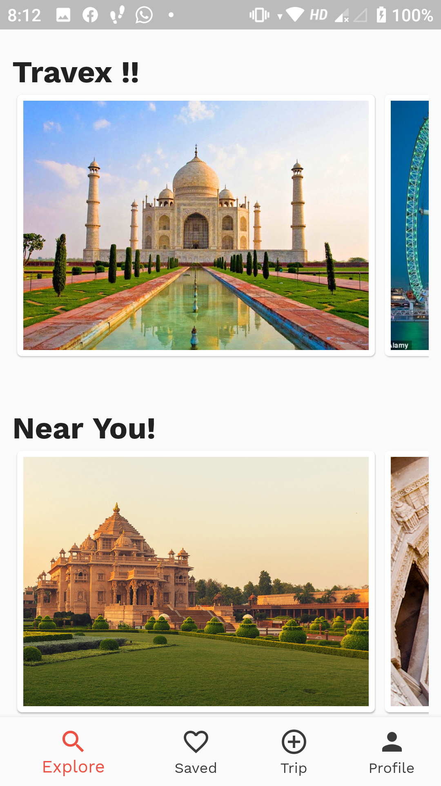
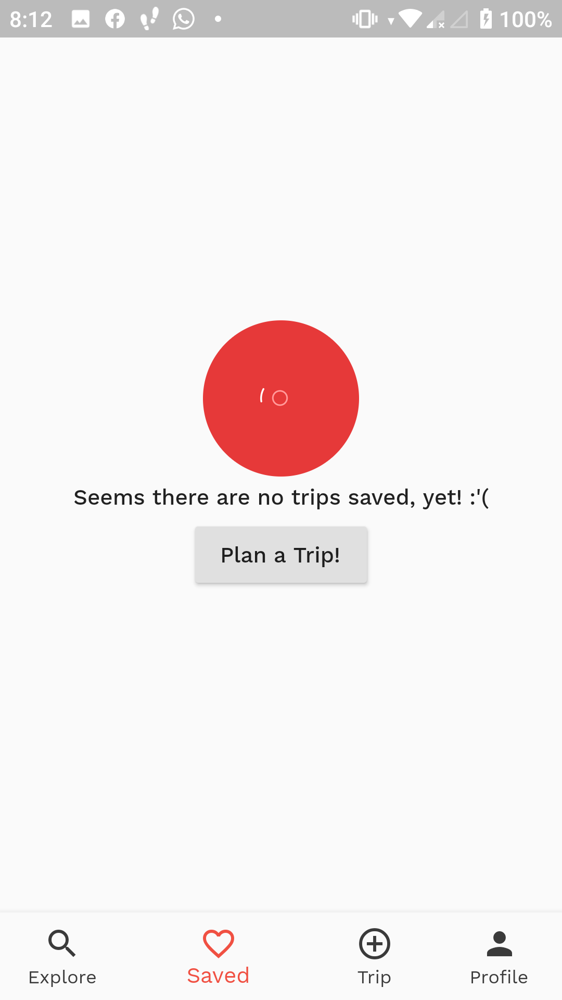
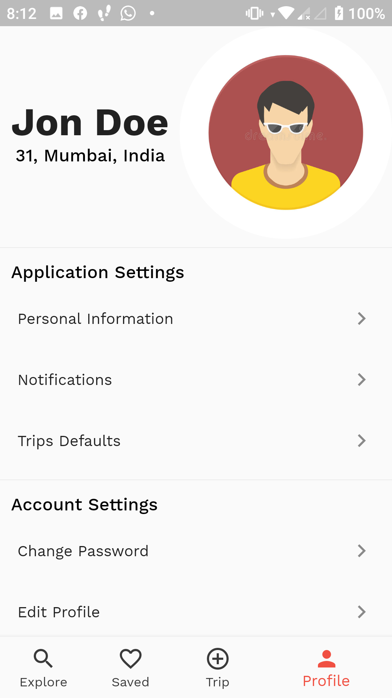
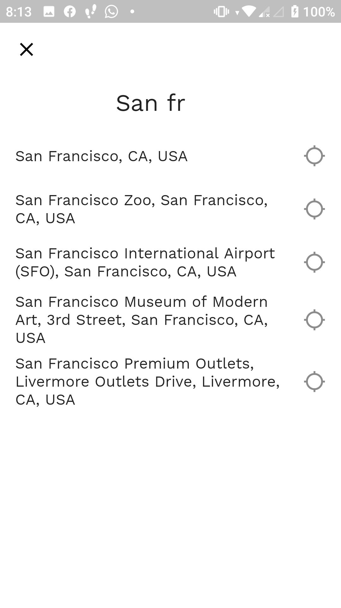
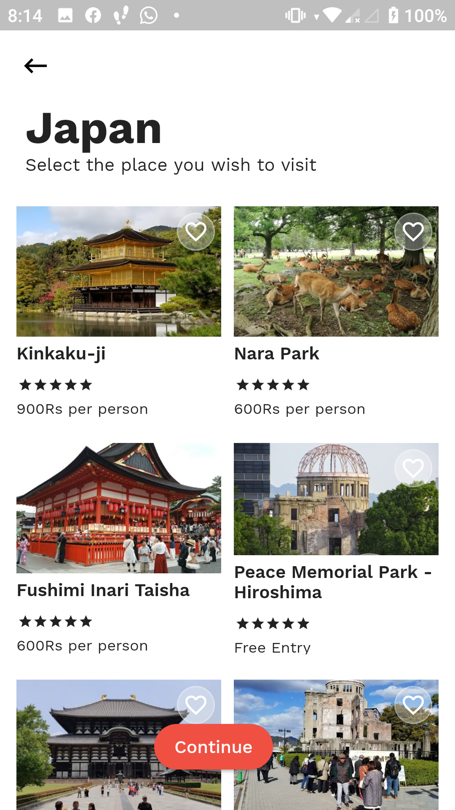
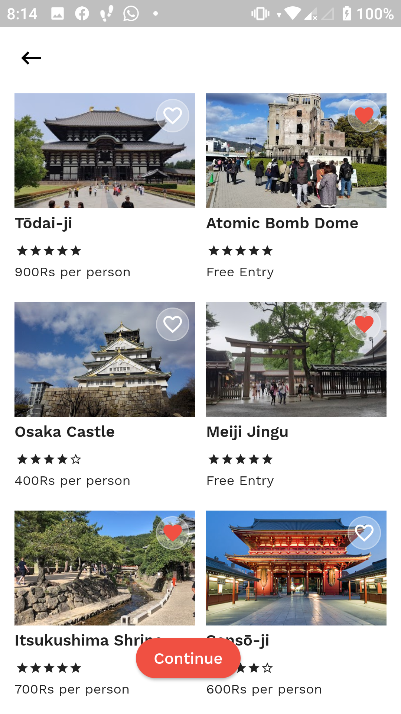
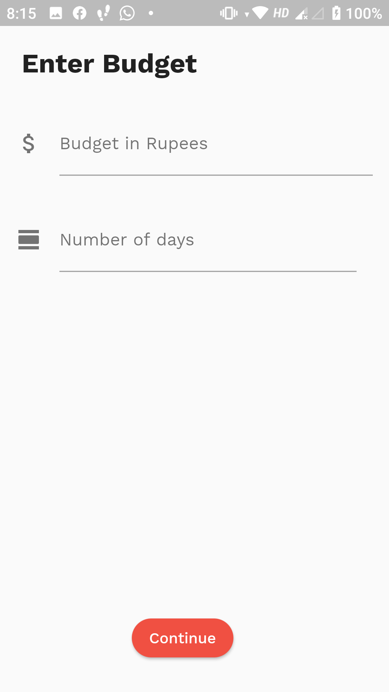
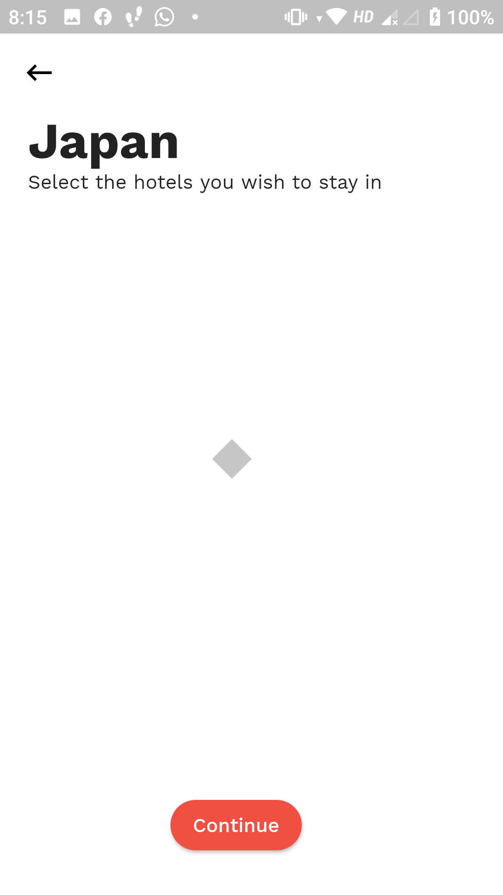
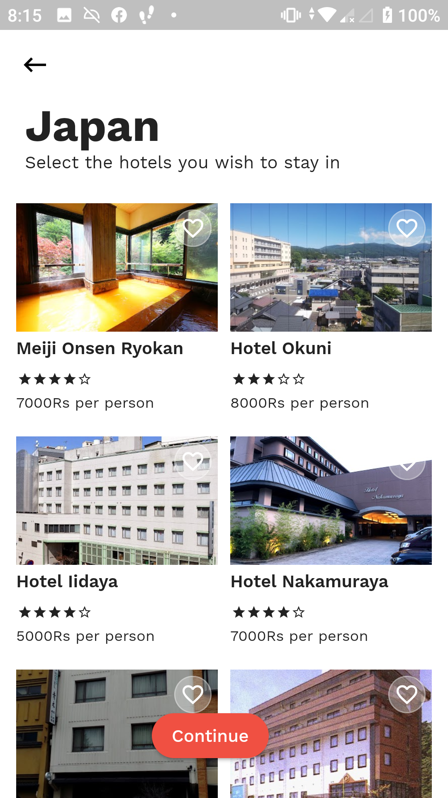

# Travex

This project is a smart tourism application, which focuses on getting users their preferred destinations and hotels in their budget.

## App Screenshots : 

  
  
  
  
  
  
  
  
  
  
  
  

